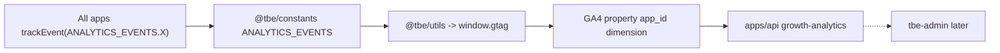

# Sprint 40 — Analytics Event Streamlining Plan

> **Notion task:** [Event Tracking Setup in Apps](https://app.notion.com/p/38f32c1a15e280baa677d2b6c969c0c5)  
> **Sprint:** Dev | Sprint 40 | release/v-2.17.0  
> **Status:** In progress — execute phases sequentially

## Goal

Streamline all event types from all TBE apps into a single GA4 property (segmented by `app_id`), with a centralized typed registry in `@tbe/constants`. Admin dashboards (tbe-admin) consume reporting APIs in a later phase.

## Phase checklist

- [x] **Phase 0** — This planning doc + per-app event catalog (AUDIT)
- [x] **Phase 1** — `ANALYTICS_EVENTS` registry in `@tbe/constants`, typed `trackEvent`, fix `envConfig.GA_TRACKING_ID`
- [x] **Phase 2** — Migrate scattered string/legacy calls to registry; reconcile legacy taxonomy
- [x] **Phase 3** — Fill per-app gaps, remove duplicate pageview in `Page.tsx`, verify `app_id` env
- [x] **Phase 4** — Verify growth-analytics API matches registry; extend API/transform tests
- [x] **Phase 5** — Registry unit tests, update audit doc, `pnpm quality:check` green
- [ ] **Phase 6 (later)** — Wire tbe-admin Growth Analytics UI to `/api/v1/admin/growth-analytics`

## Architecture



## GA4 property topology

| App               | Measurement ID env         | `app_id` env                      |
| ----------------- | -------------------------- | --------------------------------- |
| platform          | `NEXT_PUBLIC_ANALYTICS_ID` | `NEXT_PUBLIC_TBE_APP_ID=platform` |
| prep-yatra        | `NEXT_PUBLIC_ANALYTICS_ID` | `prep-yatra`                      |
| quizes            | `NEXT_PUBLIC_ANALYTICS_ID` | `quizes`                          |
| dsayatra          | `NEXT_PUBLIC_ANALYTICS_ID` | `dsayatra`                        |
| oncampus          | `NEXT_PUBLIC_ANALYTICS_ID` | `oncampus`                        |
| resume-yatra      | `NEXT_PUBLIC_ANALYTICS_ID` | `resume-yatra`                    |
| techyatra         | `NEXT_PUBLIC_ANALYTICS_ID` | `techyatra`                       |
| resources         | `NEXT_PUBLIC_ANALYTICS_ID` | `resources`                       |
| onboarding (Vite) | `VITE_ANALYTICS_ID`        | `VITE_TBE_APP_ID=onboarding`      |

Server reporting: `GA4_PROPERTY_ID` + `GA4_SERVICE_ACCOUNT_JSON` in `apps/api`.

---

## Per-app event catalog (AUDIT)

### Automatic (all apps with GA init)

| Event            | Source                             | Status |
| ---------------- | ---------------------------------- | ------ |
| `page_view`      | `useTracking` / `AnalyticsWrapper` | Wired  |
| `ui_click`       | Delegated listeners                | Wired  |
| `ui_form_submit` | Delegated listeners                | Wired  |

### platform

| Event                                                 | Status  | Notes                                           |
| ----------------------------------------------------- | ------- | ----------------------------------------------- |
| `COURSE_ENROLL`, `COURSE_COMPLETE`, `COURSE_PROGRESS` | Wired   | Shiksha pages via legacy `trackEvent`           |
| `COURSE_CHAPTER_START`                                | Wired   | `ChapterLink`, shiksha page                     |
| `INTERVIEW_SHEET_*`, `PROJECT_*`, `WEBINAR_*`         | Wired   | Container pages                                 |
| `QUESTION_START`, `QUESTION_COMPLETE`                 | Wired   | `QuestionLink`                                  |
| `CERTIFICATE_*`, `LEVEL_UP`, `POINTS_EARNED`          | Wired   | Gamification hooks                              |
| `login_click`, `login_success`, `signup_success`      | Wired   | Auth flow                                       |
| `onboarding_*`, `user_activated`                      | Wired   | Onboarding hook                                 |
| **Gap:** `search_performed` on global search          | Missing | Low priority — delegated `ui_click` covers CTAs |

### prep-yatra

| Event                                        | Status  | Notes                            |
| -------------------------------------------- | ------- | -------------------------------- |
| `prep_log_create/update/delete`              | Wired   | `@tbe/utils` + `@tbe/services`   |
| `challenge_*`, `challenge_log_create`        | Wired   | Shared packages                  |
| `skill_add`, `skill_remove`                  | Wired   | `AddSkillsModal`                 |
| `recruiter_contact_*`                        | Wired   | `@tbe/services`                  |
| Auth + onboarding lifecycle                  | Wired   | Shared hooks                     |
| **Gap:** prep-yatra-specific dashboard views | Covered | Delegated `ui_click` + pageviews |

### quizes

| Event                                       | Status | Notes                |
| ------------------------------------------- | ------ | -------------------- |
| `quiz_session_*`, `quiz_answer_submit`      | Wired  | `@tbe/utils/quiz.ts` |
| `quiz_start`, `quiz_complete`, `quiz_score` | Wired  | Analytics helpers    |
| `quiz_results_view`                         | Wired  | Results page         |
| Gamification events                         | Wired  | Shared gamification  |

### dsayatra

| Event                               | Status         | Notes                             |
| ----------------------------------- | -------------- | --------------------------------- |
| Auth + pageviews + `ui_click`       | Wired          | `useTracking`                     |
| `QUESTION_*` via gamification       | Wired          | DSA completion awards             |
| **`dsa_question_view`**             | **Phase 3**    | Question selection on sheets page |
| **Gap:** `dsa_revision_week_select` | Optional later | Revisions page                    |

### oncampus

| Event                             | Status | Notes                     |
| --------------------------------- | ------ | ------------------------- |
| `INTERVIEW_SHEET_*`, `QUESTION_*` | Wired  | Interview sheet workspace |
| Auth + delegated UI               | Wired  | `useTracking`             |

### resume-yatra

| Event                         | Status      | Notes                         |
| ----------------------------- | ----------- | ----------------------------- |
| Auth + pageviews + `ui_click` | Wired       | `useTracking`                 |
| **`resume_builder_complete`** | **Phase 3** | Result screen mount           |
| **`resume_share`**            | **Phase 3** | Share button on result screen |

### techyatra

| Event                              | Status         | Notes                           |
| ---------------------------------- | -------------- | ------------------------------- |
| Auth + pageviews + `ui_click`      | Wired          | `AnalyticsWrapper`              |
| **Gap:** tech-path-specific events | Optional later | Delegated UI sufficient for MVP |

### resources

| Event            | Status | Notes                |
| ---------------- | ------ | -------------------- |
| `share_resource` | Wired  | `ShareButton`        |
| `signup_click`   | Wired  | Gated resource lists |

### onboarding (Vite)

| Event                       | Status | Notes           |
| --------------------------- | ------ | --------------- |
| `onboarding_*`              | Wired  | `useOnboarding` |
| `user_activated`            | Wired  | On complete     |
| Custom `initGA` + listeners | Wired  | `App.tsx`       |

---

## Event registry (single source of truth)

Defined in `packages/constants/src/analyticsEvents.ts` as `ANALYTICS_EVENTS`.

### Growth analytics events (GA4 Data API)

Used by `fetchActivationAnalytics`:

- `signup_success` → `ANALYTICS_EVENTS.SIGNUP_SUCCESS`
- `user_activated` → `ANALYTICS_EVENTS.USER_ACTIVATED`

### Activation definition

User is **activated** when `user_activated` fires within **7 days** of `signup_success`.

---

## Admin API contract (Phase 6 — tbe-admin)

```
GET /api/v1/admin/growth-analytics?type=mau|activation|retention&period=30d
```

| `type`       | Response highlights                                         |
| ------------ | ----------------------------------------------------------- |
| `mau`        | `{ mau, dauTimeSeries[], period }`                          |
| `activation` | `{ signups, activated, activationRate, cohorts[], period }` |
| `retention`  | `{ cohorts[], averageRetentionCurve[], period }`            |

Returns `503` when `GA4_PROPERTY_ID` / `GA4_SERVICE_ACCOUNT_JSON` are unset.

---

## Quality gate (each phase)

```bash
pnpm quality:check
pnpm --filter @tbe/testing test
```
