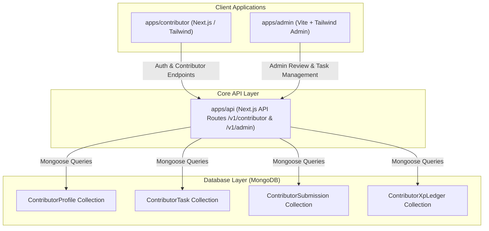

# Technical & Architecture Specification

# TBE Contributors Platform & Gamification Engine

| Metadata             | Specification                                                                              |
| :------------------- | :----------------------------------------------------------------------------------------- |
| **Document Version** | 1.0.0                                                                                      |
| **Status**           | In Review / Implementation Ready                                                           |
| **Target Monorepo**  | `TBE-Web`                                                                                  |
| **Primary Apps**     | `apps/contributor` (Next.js), `apps/admin` (Vite / React), `apps/api` (Next.js API Engine) |
| **Shared Packages**  | `@tbe/types`, `@tbe/components`, `@tbe/utils`, `@tbe/hooks`, `@tbe/auth`                   |
| **Database**         | MongoDB with Mongoose ODM                                                                  |

---

## 1. System Architecture Overview

The TBE Contributors Platform spans three existing applications and shared monorepo packages to deliver a cohesive experience for contributors and administrators:



### Component Roles

1. **`apps/contributor`**: The primary user-facing web app where learners register, choose their track, explore available tasks, submit proof-of-work, view their XP and Level, and access the "Message Founder" action.
2. **`apps/admin`**: The administrative console used by maintainers and the founder to approve/reject submissions, distribute XP, publish tasks, and monitor cohort progression.
3. **`apps/api`**: The central backend engine housing Mongoose models, validation middlewares, gamification business logic, and transactional XP ledger updates.
4. **`packages/*`**: Monorepo libraries (`@tbe/types`, `@tbe/components`, `@tbe/utils`) ensuring unified type definitions and UI component consistency.

---

## 2. Data Models & Database Schema

All database schemas reside in `apps/api/src/lib/database/models/Contributor/` and connect to the primary MongoDB cluster.

### 2.1 Enums & Types

```typescript
export type ContributorTrack = "code" | "community" | "hybrid";
export type ContributorLevel = "contributor" | "lead" | "captain";
export type TaskDifficulty = "beginner" | "intermediate" | "advanced";
export type SubmissionStatus =
  "pending" | "approved" | "changes_requested" | "rejected";
export type XpEventType =
  "task_completion" | "bonus_award" | "manual_adjustment" | "tier_promotion";
```

---

### 2.2 `ContributorProfile` Schema

Represents the contributor's account within a specific 4-month cohort.

```typescript
import { Schema, model, Document, Types } from "mongoose";

export interface IContributorProfile extends Document {
  userId: Types.ObjectId; // Reference to core User collection
  email: string;
  name: string;
  avatarUrl?: string;
  githubUsername?: string;
  linkedinUrl?: string;
  discordHandle?: string;
  telegramHandle?: string;

  // Track & Cohort Details
  primaryTrack: ContributorTrack;
  cohortId: string; // e.g. "cohort-2026-c1"
  cohortStartDate: Date;
  cohortEndDate: Date; // Exactly 4 months from start date
  isActive: boolean;

  // Gamification Metrics
  totalXp: number; // Running total maintained via ledger
  currentLevel: ContributorLevel; // "contributor" (<50 XP) | "lead" (50-99 XP) | "captain" (>=100 XP)
  contributionsCount: number; // Count of approved submissions

  createdAt: Date;
  updatedAt: Date;
}

const ContributorProfileSchema = new Schema<IContributorProfile>(
  {
    userId: {
      type: Schema.Types.ObjectId,
      ref: "User",
      required: true,
      index: true,
    },
    email: {
      type: String,
      required: true,
      lowercase: true,
      trim: true,
      index: true,
    },
    name: { type: String, required: true, trim: true },
    avatarUrl: { type: String },
    githubUsername: { type: String, trim: true },
    linkedinUrl: { type: String, trim: true },
    discordHandle: { type: String, trim: true },
    telegramHandle: { type: String, trim: true },

    primaryTrack: {
      type: String,
      enum: ["code", "community", "hybrid"],
      default: "code",
    },
    cohortId: { type: String, required: true, index: true },
    cohortStartDate: { type: Date, required: true },
    cohortEndDate: { type: Date, required: true },
    isActive: { type: Boolean, default: true },

    totalXp: { type: Number, default: 0, min: 0, index: true },
    currentLevel: {
      type: String,
      enum: ["contributor", "lead", "captain"],
      default: "contributor",
      index: true,
    },
    contributionsCount: { type: Number, default: 0, min: 0 },
  },
  { timestamps: true },
);

ContributorProfileSchema.index({ cohortId: 1, totalXp: -1 });
```

---

### 2.3 `ContributorTask` Schema

Catalog of available contributions showcasing points and guidelines.

```typescript
export interface IContributorTask extends Document {
  title: string;
  description: string;
  track: ContributorTrack;
  category:
    | "frontend"
    | "backend"
    | "fullstack"
    | "documentation"
    | "content"
    | "community"
    | "event";
  difficulty: TaskDifficulty;
  xpPoints: number; // Points awarded upon completion (e.g., 10, 25, 50)
  githubIssueUrl?: string; // Direct link if issue on GitHub
  guidelinesUrl?: string; // Guidelines for content/community tasks
  maxSubmissions?: number; // If capped (e.g. 1 assignee or multi-claim)
  currentSubmissionsCount: number;
  isOpen: boolean;
  createdBy: Types.ObjectId; // Admin user who published the task
  createdAt: Date;
  updatedAt: Date;
}

const ContributorTaskSchema = new Schema<IContributorTask>(
  {
    title: { type: String, required: true, trim: true },
    description: { type: String, required: true },
    track: {
      type: String,
      enum: ["code", "community", "hybrid"],
      required: true,
      index: true,
    },
    category: {
      type: String,
      enum: [
        "frontend",
        "backend",
        "fullstack",
        "documentation",
        "content",
        "community",
        "event",
      ],
      required: true,
    },
    difficulty: {
      type: String,
      enum: ["beginner", "intermediate", "advanced"],
      required: true,
    },
    xpPoints: { type: Number, required: true, min: 1 },
    githubIssueUrl: { type: String, trim: true },
    guidelinesUrl: { type: String, trim: true },
    maxSubmissions: { type: Number, default: null },
    currentSubmissionsCount: { type: Number, default: 0 },
    isOpen: { type: Boolean, default: true, index: true },
    createdBy: {
      type: Schema.Types.ObjectId,
      ref: "AdminUser",
      required: true,
    },
  },
  { timestamps: true },
);
```

---

### 2.4 `ContributorSubmission` Schema

Records work proof submitted by contributors for review.

```typescript
export interface IContributorSubmission extends Document {
  contributorId: Types.ObjectId; // Reference to ContributorProfile
  userId: Types.ObjectId; // Reference to User
  taskId?: Types.ObjectId; // Optional reference to ContributorTask (null if independent)
  customTitle?: string; // Populated if independent task
  track: ContributorTrack;
  proofUrl: string; // GitHub PR URL, Blog URL, Social Media Link, Drive URL
  notes: string; // Contributor's notes on what was accomplished

  // Review Status
  status: SubmissionStatus; // "pending" | "approved" | "changes_requested" | "rejected"
  xpAwarded: number; // Points granted upon approval
  reviewedBy?: Types.ObjectId; // Admin user
  reviewedAt?: Date;
  reviewerFeedback?: string; // Feedback visible to contributor

  createdAt: Date;
  updatedAt: Date;
}

const ContributorSubmissionSchema = new Schema<IContributorSubmission>(
  {
    contributorId: {
      type: Schema.Types.ObjectId,
      ref: "ContributorProfile",
      required: true,
      index: true,
    },
    userId: {
      type: Schema.Types.ObjectId,
      ref: "User",
      required: true,
      index: true,
    },
    taskId: {
      type: Schema.Types.ObjectId,
      ref: "ContributorTask",
      default: null,
      index: true,
    },
    customTitle: { type: String, trim: true },
    track: {
      type: String,
      enum: ["code", "community", "hybrid"],
      required: true,
    },
    proofUrl: { type: String, required: true, trim: true },
    notes: { type: String, required: true },

    status: {
      type: String,
      enum: ["pending", "approved", "changes_requested", "rejected"],
      default: "pending",
      index: true,
    },
    xpAwarded: { type: Number, default: 0 },
    reviewedBy: { type: Schema.Types.ObjectId, ref: "AdminUser" },
    reviewedAt: { type: Date },
    reviewerFeedback: { type: String, trim: true },
  },
  { timestamps: true },
);
```

---

### 2.5 `ContributorXpLedger` Schema

Immutable record of all XP movements, ensuring mathematical auditability.

```typescript
export interface IContributorXpLedger extends Document {
  contributorId: Types.ObjectId;
  userId: Types.ObjectId;
  submissionId?: Types.ObjectId;
  eventType: XpEventType;
  xpDelta: number; // Number of XP points gained (positive) or adjusted
  balanceAfter: number; // Contributor total XP after this transaction
  reason: string;
  adminId?: Types.ObjectId;
  createdAt: Date;
}

const ContributorXpLedgerSchema = new Schema<IContributorXpLedger>(
  {
    contributorId: {
      type: Schema.Types.ObjectId,
      ref: "ContributorProfile",
      required: true,
      index: true,
    },
    userId: {
      type: Schema.Types.ObjectId,
      ref: "User",
      required: true,
      index: true,
    },
    submissionId: {
      type: Schema.Types.ObjectId,
      ref: "ContributorSubmission",
      index: true,
    },
    eventType: {
      type: String,
      enum: [
        "task_completion",
        "bonus_award",
        "manual_adjustment",
        "tier_promotion",
      ],
      required: true,
    },
    xpDelta: { type: Number, required: true },
    balanceAfter: { type: Number, required: true },
    reason: { type: String, required: true },
    adminId: { type: Schema.Types.ObjectId, ref: "AdminUser" },
  },
  { timestamps: { createdAt: true, updatedAt: false } },
);
```

---

## 3. Level Progression & Gamification Logic

### 3.1 Level Derivation Function

The contributor's tier is calculated deterministically from `totalXp`:

$$ \text{Level}(XP) = \begin{cases}
\text{TBE Contributor} & 0 \le XP < 50 \\
\text{TBE Lead} & 50 \le XP < 100 \\
\text{TBE Captain} & XP \ge 100
\end{cases}$$

```typescript
export function computeContributorLevel(xp: number): ContributorLevel {
  if (xp >= 100) return "captain";
  if (xp >= 50) return "lead";
  return "contributor";
}
```

### 3.2 Atomic Approval & XP Awarding Flow
When an administrator approves a submission:
1. Verify reviewer authorization (`AdminUser`).
2. Read submission: ensure status is `pending` or `changes_requested`.
3. Open a Mongoose session / transaction:
   - Calculate new total XP: `newTotalXp = profile.totalXp + xpToAward`.
   - Compute new level: `newLevel = computeContributorLevel(newTotalXp)`.
   - Insert `ContributorXpLedger` record (`xpDelta: xpToAward`, `balanceAfter: newTotalXp`).
   - Update `ContributorProfile`: `totalXp = newTotalXp`, `currentLevel = newLevel`, `$inc: { contributionsCount: 1 }`.
   - Update `ContributorSubmission`: `status = "approved"`, `xpAwarded = xpToAward`, `reviewedBy = adminId`, `reviewedAt = new Date()`, `reviewerFeedback = feedback`.
   - If task linked: `$inc: { currentSubmissionsCount: 1 }`.
4. Trigger notification / webhook (e.g. notify contributor in Discord/email).

---

## 4. API Endpoints & Route Contracts

All routes follow the existing TBE API structure under `apps/api/src/pages/api/v1/`:

### 4.1 Contributor Endpoints (`/api/v1/contributor/*`)

#### 1. `GET /api/v1/contributor/profile`
- **Auth**: User Session required.
- **Response**:
```json
{
  "success": true,
  "data": {
    "profile": {
      "id": "660c1...",
      "name": "Jane Doe",
      "email": "jane@example.com",
      "primaryTrack": "code",
      "cohortId": "cohort-2026-c1",
      "cohortEndDate": "2026-08-08T00:00:00.000Z",
      "daysRemaining": 112,
      "totalXp": 45,
      "currentLevel": "contributor",
      "nextLevel": "lead",
      "xpToNextLevel": 5,
      "progressPercent": 90
    }
  }
}
```

#### 2. `POST /api/v1/contributor/onboard`
- **Auth**: User Session required.
- **Request Body**:
```json
{
  "primaryTrack": "code",
  "githubUsername": "janedoe",
  "linkedinUrl": "https://linkedin.com/in/janedoe",
  "discordHandle": "jane#1234",
  "firstContributionGoal": "Fix issue #42 in platform app"
}
```
- **Action**: Creates `ContributorProfile` initialized with a 4-month end date (`start + 120 days`) and `totalXp: 0`.

#### 3. `GET /api/v1/contributor/tasks`
- **Query Params**: `track` (code|community|all), `difficulty`, `category`, `page`, `limit`.
- **Response**:
```json
{
  "success": true,
  "data": {
    "tasks": [
      {
        "id": "660d2...",
        "title": "Add dark mode toggle to contributor nav",
        "description": "Implement theme switcher using Tailwind classes in apps/contributor",
        "track": "code",
        "category": "frontend",
        "difficulty": "beginner",
        "xpPoints": 15,
        "githubIssueUrl": "https://github.com/The-Boring-Education/TBE-Web/issues/108"
      }
    ],
    "totalCount": 24
  }
}
```

#### 4. `POST /api/v1/contributor/submissions`
- **Auth**: User Session required.
- **Request Body**:
```json
{
  "taskId": "660d2...",
  "track": "code",
  "customTitle": null,
  "proofUrl": "https://github.com/The-Boring-Education/TBE-Web/pull/245",
  "notes": "Added ThemeProvider, tested locally across chrome and firefox."
}
```
- **Response**: `201 Created` with submission object in `pending` status.

#### 5. `GET /api/v1/contributor/dashboard`
- **Auth**: User Session required.
- **Returns**: Aggregated dashboard payload: Profile overview, XP total, current Tier, list of submissions (status, XP, feedback), and cohort deadline counter.

#### 6. `POST /api/v1/contributor/message-founder`
- **Auth**: User Session required.
- **Request Body**:
```json
{
  "category": "mentorship" | "proposal" | "task_blocker" | "general",
  "subject": "Proposal for college campus study jam",
  "message": "Hey Sachin, we want to host a TBE React workshop in Delhi next Saturday..."
}
```
- **Action**: Dispatches notification directly to founder inbox/Telegram bot and logs audit event.

---

### 4.2 Admin Endpoints (`/api/v1/admin/contributor/*`)

#### 1. `GET /api/v1/admin/contributor/submissions`
- **Auth**: Admin Guard required.
- **Query Params**: `status=pending`, `track`, `page`, `limit`.
- **Returns**: List of submissions pending maintainer review with populated contributor info.

#### 2. `POST /api/v1/admin/contributor/submissions/:id/review`
- **Auth**: Admin Guard required.
- **Request Body**:
```json
{
  "action": "approve" | "changes_requested" | "reject",
  "xpAwarded": 25,
  "feedback": "Great work on the responsive navbar! PR is merged."
}
```
- **Action**: Executes atomic session transaction updating submission, adding ledger entry, updating user XP, and recomputing level.

#### 3. `POST /api/v1/admin/contributor/tasks`
- **Auth**: Admin Guard required.
- **Request Body**: `title`, `description`, `track`, `category`, `difficulty`, `xpPoints`, `githubIssueUrl`.

---

## 5. Frontend UI/UX Structure (`apps/contributor`)

The frontend application uses Next.js Pages router with Tailwind CSS and `@tbe/components`.

### 5.1 Route Map
- `/` - Public Landing Page & Program Overview (tracks, perks, roles, FAQ).
- `/onboard` - Step-by-step onboarding wizard for joining the active cohort.
- `/dashboard` - Contributor Command Center (XP bar, Tier badge, Submissions table, "Message Founder" button).
- `/tasks` - Explore available tasks catalog with filtering and "Pick Task" CTA.
- `/submit` - Submission modal / drawer to deliver proof-of-work.

### 5.2 Key UI Components

```
apps/contributor/src/components/
├── dashboard/
│   ├── ContributorHeader.tsx       # Name, Avatar, Level badge, 4-Month countdown
│   ├── XpProgressTracker.tsx       # 0 -> 50 (Lead) -> 100 (Captain) milestone bar
│   ├── SubmissionsTable.tsx        # Filterable list of all submitted contributions
│   ├── QuickActionCard.tsx         # "Pick New Task", "Submit Contribution"
│   └── MessageFounderButton.tsx    # Prominent button opening MessageFounderModal
├── tasks/
│   ├── TaskFilterBar.tsx           # Track, Difficulty, Points filters
│   ├── TaskCard.tsx                # Title, Points badge, Difficulty badge, CTA
│   └── TaskDetailModal.tsx         # Detailed instructions + "Submit Work" button
├── modals/
│   ├── SubmitContributionModal.tsx # Proof URL, task select, notes textarea
│   └── MessageFounderModal.tsx     # Direct note to Sachin Shukla with channel options
└── shared/
    ├── LevelBadge.tsx              # "Contributor" (Gray/Blue), "Lead" (Purple), "Captain" (Gold)
    └── TrackBadge.tsx              # "Code Track" (Cyan), "Community Track" (Amber)
```

### 5.3 UI State Progression: XP & Tier Badges
- **Contributor Tier (0–49 XP)**: Slate/Blue theme badge, tooltip: *"Contribute tasks to reach Lead (50 XP)"*.
- **Lead Tier (50–99 XP)**: Indigo/Purple badge, tooltip: *"Lead initiatives to unlock Captain (100 XP)"*.
- **Captain Tier (100+ XP)**: Premium Gold/Amber badge with Hat/Crown icon, confetti celebration on first trigger, unlocking Founder 1:1 booking link.

---

## 6. Implementation Milestones & Work Breakdown

### Phase 1: Database Schemas & Core API (`apps/api`)
- [ ] Create `ContributorProfile`, `ContributorTask`, `ContributorSubmission`, `ContributorXpLedger` Mongoose models in `apps/api/src/lib/database/models/Contributor/`.
- [ ] Implement query helpers in `apps/api/src/lib/database/queries/contributor.ts`.
- [ ] Build `/api/v1/contributor/*` endpoints (profile, onboard, tasks, submissions, message-founder).
- [ ] Build `/api/v1/admin/contributor/*` endpoints (review submission, mint XP, manage tasks).
- [ ] Add unit tests in `apps/testing` verifying atomic XP calculation and Captain milestone trigger.

### Phase 2: Contributor Portal Pages (`apps/contributor`)
- [ ] Build `/onboard` wizard with track selection (Code vs. Community).
- [ ] Build `/tasks` catalog page with filter bar and task cards displaying points.
- [ ] Build `/dashboard` displaying:
  - Total XP and Level progression bar (Contributor → Lead → Captain).
  - 4-Month Cohort countdown timer.
  - Submissions list with status badges (`Pending`, `Approved`, `Changes Requested`, `Rejected`).
  - "Message Founder" persistent floating/header button & modal.
- [ ] Build `SubmitContributionModal` allowing proof URL inputs.

### Phase 3: Admin Review Console (`apps/admin`)
- [ ] Add "Contributors" navigation section in `apps/admin`.
- [ ] Build Submissions Review Queue (`/admin/contributors/submissions`) with inline proof review, XP input, and approval/rejection feedback forms.
- [ ] Build Task Publisher interface (`/admin/contributors/tasks/new`).

### Phase 4: Cohort Management & Final Polish
- [ ] Implement automated 4-month lifecycle calculation and graduation status.
- [ ] Implement email / Discord webhooks for submission status changes.
- [ ] End-to-end testing with Playwright in `apps/testing/`.
